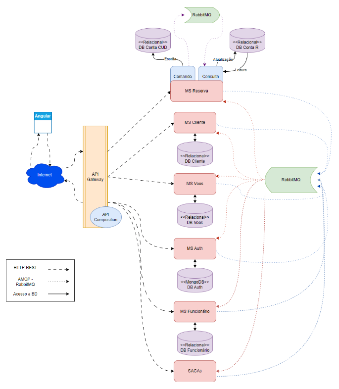

# **Planejamento de Desenvolvimento do Backend**

### **Arquitetura do Sistema:** 

---

## **Definição de Entidades e Tabelas**

## **Entidades:**

**Autenticação**: responsável pela autenticação no Sistema;

**Cliente**: responsável pela manutenção de clientes;

**Voos**: responsável pela manutenção dos voos;

**Reservas**: responsável pela manutenção das reservas feitas pelos clientes;

**Funcionário**: responsável pela manutenção dos dados de funcionários;

## **Tabelas:**

O Banco de dados de autenticação deve ser MongoDB, os demais devem se PostgreSQL;

### **Autenticação**:
- **Tabela para Dados de Usuário**: 
  - login
  - senha
  - Tipo (cliente/funcionário)

### **Cliente**:
- **Tabela para Dados de Cliente**: 
  - CPF
  - Nome
  - E-mail
  - Rua/Número
  - Complemento
  - CEP
  - Cidade
  - UF
  - Milhas

- **Tabela de Transações de Milhas**: 
  - Cliente
  - data/hora transação
  - quantidade de milhas
  - entrada/saída
  - descrição

### **Voos**:
- **Tabela de Aeroportos**: 
  - Código de 3 letras
  - Nome do aeroporto
  - Cidade
  - UF (deve estar pré-cadastrado)

- **Tabela de Voos**: 
  - Código do voo
  - Data/hora
  - aeroporto origem
  - aeroporto destino
  - valor da passagem em reais
  - quantidade de poltronas total
  - quantidade de poltronas ocupadas
  - Estado do Voo

- **Tabela de Estado de Voo**: 
  - Código do estado
  - Sigla do estado
  - Descrição do estado (deve estar pré-cadastrada: CONFIRMADO, CANCELADO, REALIZADO)

### **Reservas**:
- **Tabela de Reserva**: 
  - Código da reserva
  - código do voo
  - data/hora da reserva
  - Estado da reserva

- **Tabela de Histórico de Alteração de Estado de Reserva**: 
  - Código da reserva
  - data/hora da alteração do estado da reserva
  - estado origem
  - estado destino

- **Tabela de Estado de Reserva**: 
  - Código do estado
  - Sigla do estado
  - Descrição do estado (deve estar pré-cadastrada: CRIADA, CHECK-IN, CANCELADA, CANCELADA VOO, EMBARCADA, REALIZADA, NÃO REALIZADA)

### **Funcionário**:
- **Tabela de Funcionário**: 
  - Nome
  - CPF
  - E-mail
  - Telefone

---
---

## Pré-requisitos Iniciais
Configurar ambiente de desenvolvimento com:
- Docker e Docker Compose
- Node.js (para API Gateway)
- Java JDK 17+ (para microsserviços Spring Boot)
- Postman para testar APIs
- RabbitMQ
- PostgreSQL e MongoDB

---

## **Cronograma Semanal**

## Semana 1: Configuração Inicial e Microsserviço de Autenticação

### Objetivos:
- Configurar estrutura básica do projeto
- Implementar microsserviço de Autenticação
- Configurar API Gateway básico

### Tarefas:

#### 1 - Configuração de Infraestrutura:
- Criar arquivos Docker (Dockerfile e docker-compose.yml) para:
  - Microservico (criar template)
  - API Gateway
  - PostgreSQL (para microsserviços)
  - MongoDB (para autenticação)
  - RabbitMQ
- Configurar redes Docker para comunicação entre containers

#### 2 - Microsserviço de Autenticação:
- Criar projeto Spring Boot
- Configurar conexão com MongoDB
- Modelar entidade User (ver definição entidades)
- Implementar:
  - Cadastro de usuário (para R01, R17)
  - Login (R02) com JWT
  - Geração de senha aleatória de 4 dígitos
  - Envio de senha por email
  - Criptografia de senha com SHA256+SALT

#### 3 - API Gateway:
- Criar projeto Node.js
- Configurar roteamento básico para o microsserviço de Autenticação
- Implementar middleware de autenticação JWT

---

## Semana 2: Microsserviço de Cliente e Integração ViaCEP

### Objetivos:
- Implementar microsserviço de Cliente
- Integrar com API ViaCEP
- Conectar com microsserviço de Autenticação via SAGA

### Tarefas:

#### 1 - Microsserviço de Cliente:
- Criar projeto Spring Boot
- Configurar PostgreSQL
- Modelar entidade Cliente e TransacaoMilhas (ver definição entidades)
- Implementar:
  - Autocadastro (R01) com SAGA (Cliente + Autenticação)
  - Integração com ViaCEP para preenchimento de endereço
  - CRUD básico de cliente
  - Compra de milhas (R05)
  - Consulta de extrato (R06)

#### 2 - SAGA Orquestrada para Autocadastro:
- Criar classes para orquestração no microsserviço de Autenticação
- Implementar eventos:
  - CriarUsuarioEvent
  - UsuarioCriadoEvent
  - CompensarUsuarioEvent
- Configurar filas RabbitMQ

#### 3 - API Gateway:
- Adicionar rotas para o microsserviço de Cliente

---

## Semana 3: Microsserviço de Voos e Aeroportos

### Objetivos:
- Implementar microsserviço de Voos
- Popular banco com dados iniciais de aeroportos e estados de voo

### Tarefas:

#### 1 - Microsserviço de Voos:
- Criar projeto Spring Boot
- Configurar PostgreSQL
- Modelar entidades Aeroporto, EstadoVoo e Voo (ver definição entidades)
- Implementar:
  - Cadastro de voo (R15)
  - Listagem de voos com filtros (para R07)
  - Atualização de estado de voo (R13, R14)
  - Consulta de voo por ID

#### 2 - Dados Iniciais para o BD:
- Criar script's SQL para inserir:
  - Aeroportos principais (GRU, CWB, GIG, etc.)
  - Estados de voo (CONFIRMADO, CANCELADO, REALIZADO)

#### 3 - Integração:
- Configurar comunicação com API Gateway

---

## Semana 4: Microsserviço de Reservas (Parte 1 - Comando)

### Objetivos:
- Implementar parte de comando do microsserviço de Reservas
- Configurar CQRS inicial

### Tarefas:

#### 1 - Microsserviço de Reservas (Comando):
- Criar projeto Spring Boot
- Configurar PostgreSQL para banco de comando
- Modelar entidades EstadoReserva, Reserva e HistoricoReserva (ver definição entidades)
- Adicionar status de reserva pré-cadastrados
- Implementar:
  - Criação de reserva (R07) com SAGA (Reserva, Voo, Cliente)
  - Geração do código de reserva (3 letras + 3 números)
  - Cancelamento de reserva (R08)
  - Check-in (R10)
  - Atualização de estados

#### 2 - SAGA para Efetuar Reserva:
- Criar orquestrador de reserva
- Implementar eventos:
  - IniciarReservaEvent
  - ReservarVooEvent
  - AtualizarMilhasEvent
  - ReservaConfirmadaEvent
  - CompensarReservaEvent

#### 3 - Configuração CQRS:
- Criar estrutura básica para banco de leitura (PostgreSQL)
- Configurar listener para eventos de atualização

---

## Semana 5: Microsserviço de Reservas (Parte 2 - Consulta) e Funcionários

### Objetivos:
- Completar microsserviço de Reservas com CQRS
- Implementar microsserviço de Funcionários

### Tarefas:

#### 1 - Microsserviço de Reservas (Consulta):
- Configurar PostgreSQL para banco de leitura
- Modelar documento (@Document) desnormalizado ReservaConsulta
- Implementar:
  - Consulta de reserva por código (R04, R09)
  - Listagem de reservas por cliente
  - Atualização assíncrona via RabbitMQ

#### 2 - Microsserviço de Funcionários:
- Criar projeto Spring Boot
- Configurar PostgreSQL
- Modelar entidade Funcionario (ver definição entidades)
- Implementar:
  - CRUD de funcionários (R16-R19)
  - SAGA para inserção/remoção (com Autenticação)

#### 3 - Integração:
- Atualizar API Gateway com novas rotas
- Testar fluxos completos

---

## Semana 6: Integração Completa e Testes de SAGAs

### Objetivos:
- Integrar todos os microsserviços
- Testar e refinar SAGAs
- Implementar API Composition

### Tarefas:

#### 1 - API Composition:
- Implementar no API Gateway:
  - Tela inicial do cliente (R03) - agrega dados de Cliente e Reservas
  - Tela inicial do funcionário (R11) - agrega dados de Voos

#### 2 - Refinamento de SAGAs:
- Testar e corrigir:
  - Autocadastro
  - Efetuar Reserva
  - Confirmação de Embarque
  - Cancelamento de Voo
- Implementar compensações adequadas

#### 3 - Validações:
- Adicionar validações em todos os endpoints
- Implementar tratamento de erros consistente

#### 4 - Testes:
- Criar testes de integração para fluxos principais
- Testar resiliência (falhas em microsserviços)

---

## Semana 7: Finalização de Requisitos e Otimizações

### Objetivos:
- Implementar requisitos pendentes
- Otimizar desempenho

### Tarefas:

#### 1 - Requisitos Pendentes:
- Confirmação de embarque (R12)
- Realização de voo (R14) e impactos nas reservas
- Cancelamento de voo (R13) e compensação

#### 2 - Otimizações:
- Cache no API Gateway (Redis)
- Paginação em listagens
- Indexação de bancos de dados

#### 3 - Segurança:
- Revisar mecanismos de autenticação/autorização
- Validar proteção de endpoints

---

## Semana 8: Testes Finais e Preparação para Produção

### Objetivos:
- Preparar ambientes para produção
- Documentação final

### Tarefas:

#### 1 - Preparação:
- Configurar variáveis de ambiente
- Criar scripts de deploy

#### 2 - Entrega:
- Revisão final de código
- Documentação completa (para entregar em pdf)
- Preparar apresentação

---

## Checklist de Entregas por Microsserviço:

### Autenticação:
- Cadastro de usuário (SAGA)
- Login com JWT
- Gerenciamento básico de usuários

### Cliente:
- CRUD de clientes
- Integração ViaCEP
- Gestão de milhas (compra, extrato)
- Participação em SAGAs

### Voos:
- CRUD de voos
- Gestão de aeroportos
- Atualização de estados de voo
- Participação em SAGAs

### Reservas (Comando):
- Criação de reserva (SAGA)
- Atualização de estados
- Cancelamento
- Check-in

### Reservas (Consulta):
- Modelo desnormalizado
- Consultas otimizadas
- Sincronização via eventos

### Funcionários:
- CRUD de funcionários
- SAGA com Autenticação

### API Gateway:
- Roteamento
- Autenticação
- API Composition
- Tratamento de erros

### Estrutura de Pastas Recomendada:

- **Raiz do projeto**:
  - `docker-compose.yml`: Arquivo principal de configuração dos containers

- **Cada microsserviço tem sua própria pasta**:
  - `api-gateway/`: Contém a configuração e código do API Gateway
    - `Dockerfile`: Configuração específica do container
    - `...`: Código fonte da aplicação

  - `auth-service/`: Microsserviço de autenticação
    - `Dockerfile`: Configuração do container
    - `...`: Código fonte

  - `client-service/`: Microsserviço de clientes
    - `Dockerfile`: Configuração do container  
    - `...`: Código fonte

  - `flight-service/`: Microsserviço de voos
    - `Dockerfile`: Configuração do container
    - `...`: Código fonte

  - `reservation-service/`: Microsserviço de reservas  
    - `Dockerfile`: Configuração do container
    - `...`: Código fonte

  - `employee-service/`: Microsserviço de funcionários
    - `Dockerfile`: Configuração do container
    - `...`: Código fonte
